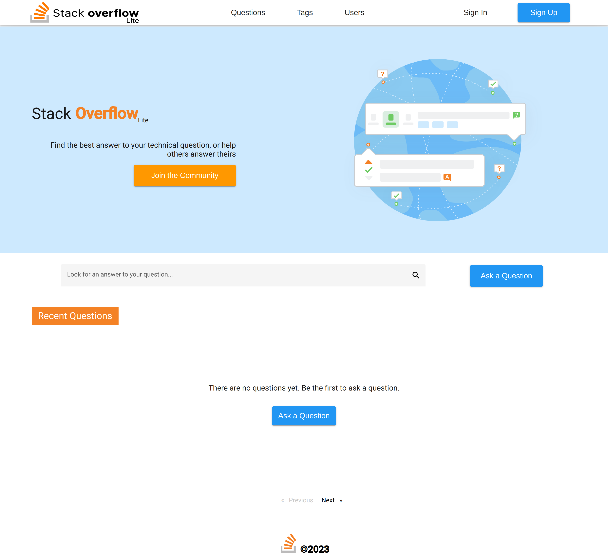

# Stack Overflow-lite

Stack Overflow lite is a WebApp I [designed](https://www.figma.com/proto/c3OP0QBGhJuXclPwW51eeR/Stackoverflow-Lite-WebApp?node-id=1%3A2&scaling=scale-down&page-id=0%3A1&starting-point-node-id=1%3A2&show-proto-sidebar=1) and developed as part of THEJitu cohort 9 Full-Stack Web Development Training program. It allows users to post questions and answers on various tags/topics. Users can upvote/downvote, comment on questions and answers. The application also has an admin dashboard for managing users, questions and answers.

## Tech Stack

### Frontend

Responsive UI design with:

- Figma - UI design and prototyping
- Angular 15 - frontend framework
- NgRx - state management
- Angular Material - UI components
- ng2-charts - charts
- Stacks Editor - rich text editor

### Backend

RESTful API with:

- TypeScript - programming language
- Node.js - runtime environment
- Express.js - web framework
- Nodemailer - sending emails
- EJS - for email templates
- Node Cron - background services
- MSSQL(Stored Procedures & Queries only, no ORM)
- JWT - authentication and authorization
- Bcrypt - password hashing
- Dotenv - environment variables
- Winston & Morgan - logging
- Joi - dtos validation and sanitization
- Postman - API testing and documentation

### Features

- Question and answer posting with rich text editor (Stacks Editor)
- Search and filter questions/answers by tags/content
- Upvote and downvote questions and answers
- Commenting on questions and answers
- Real-time UI updates with NgRx
- User authentication and authorization with JWT
- User dashboard for managing user profile, questions and answers
- Password recovery with JWT and Nodemailer
- Emails with Nodemailer and EJS for:
  - Notifications new users, questions and answers
  - Password recovery.
- Background services with Node Cron for:
  - Sending scheduled emails and tasks
- Admin dashboard for managing user accounts, questions, and answers
- Soft deletes for users, questions and answers

### Installation

#### Prerequisites

- Node.js
- NPM
- Angular CLI v15
- MSSQL Server 2022

#### Frontend

#### Backend

1. Clone the repository.
2. Run npm install to install the dependencies.
3. Create a database in MSSQL and update the database configuration in .env.
4. Run the database migration scripts to create the necessary tables and stored procedures.
5. Start the server with npm run dev.
6. Send API requests to http://localhost:5500 using the [Postman collection](#)
   or any other API client.

### Screenshots

### Contributing

Contributions to this project are welcome. For major changes, please open an issue first to discuss what you would like to change.

### Acknowledgements

This project was inspired by Stack Overflow. Special thanks to the Stack Overflow team for creating such a useful resource for developers around the world.

Special thanks to [THJitu](https://thejitu.com) for the opportunity to learn and grow as a developer and to our instructor during the program Mr. [Jonathan Ndambuki](https://www.linkedin.com/in/jonathan-ndambuki-84630a219/) for his guidance and support throughout the program. 🙏🏾

Shoutout to my fellow Cohort 9 trainees for the collaborations, encouragement, friendship and memories we made together. 🤗

Was an awesome experience and I'm glad to have been part of it. 🥳

We did it! 🎉🎉🎉
